  

<h1 align="center">Hey, I'm Yash Aggarwal 👋</h1>

  <em>CS Student &nbsp;·&nbsp; ML / AI Enthusiast &nbsp;·&nbsp; India</em>

---

### About Me

I'm a Computer Science undergraduate building at the intersection of **data science** and **software engineering** — from digit-recognizing CNNs to full-stack web apps. I love turning raw data into meaningful models and clean code into real products.

- 🧠 &nbsp;Exploring **Machine Learning, Deep Learning, and Data Science**
- 🌐 &nbsp;Building full-stack projects with **JavaScript, TypeScript & Python**
- 📱 &nbsp;Crafting mobile experiences with **Flutter**
- 📊 &nbsp;Fascinated by how models learn — currently diving deeper into **neural networks**
- 🤝 &nbsp;Open to **collaborations, research projects, and internships**

---

### 🛠️ Tech Stack

---

### 📌 Featured Projects

| Project | Description | Stack |
|---|---|---|
| [Digit Recognition CNN](https://github.com/Yash1309-coder/digit-recognition-using-cnn-) | Handwritten digit classifier using Convolutional Neural Networks | Python, Jupyter |
| [3D Portfolio Website](https://github.com/Yash1309-coder/3d-Portfolio-Website--main) | Interactive 3D developer portfolio | JavaScript |
| [Nexus Arena](https://github.com/Yash1309-coder/nexus-arena) | E-sports tournament web platform | TypeScript |
| [Water Reminder App](https://github.com/Yash1309-coder/Water_Reminder_app) | Flutter app to track daily hydration | Dart / Flutter |

---

  <em>"The goal is to turn data into information, and information into insight."</em>

